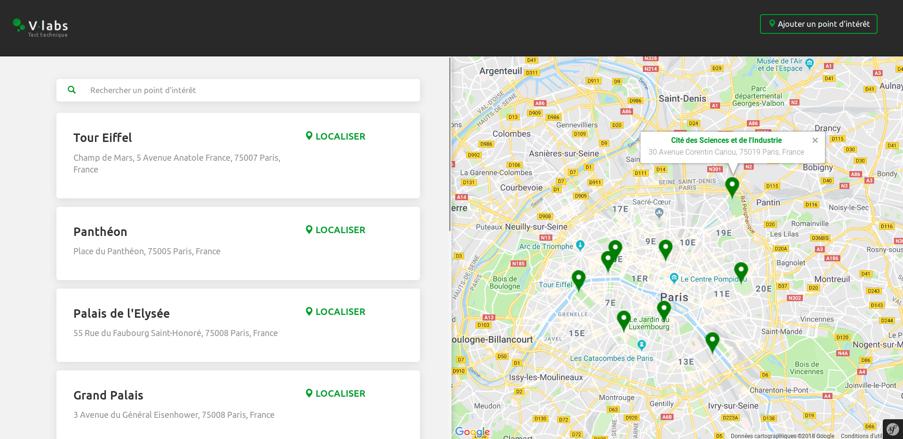
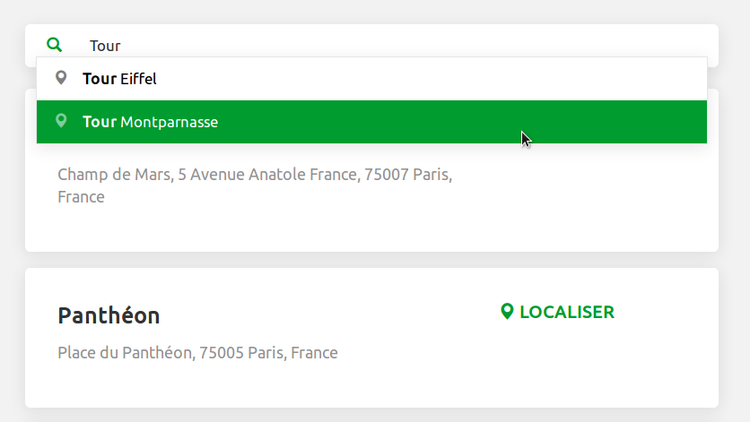
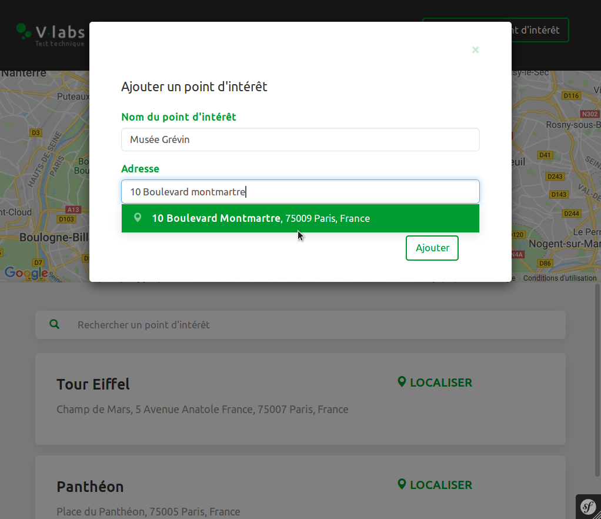
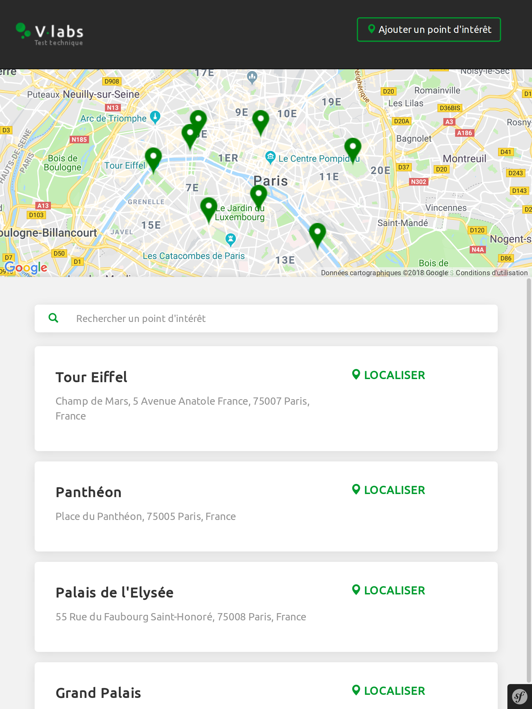
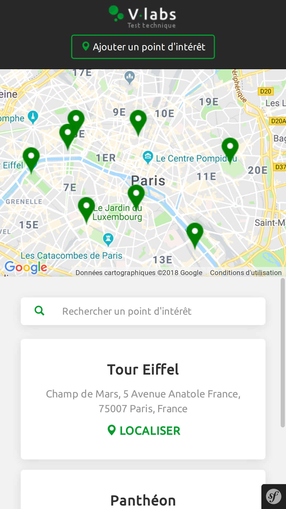

# Test technique pour VLabs 

## Installation

`composer install`

`nano .env`

Mettre à jour les données de connexion à la base de données et la clé pour Google Maps API

`yarn install`

`yarn run encore dev`

`php bin/console doctrine:database:create`

`php bin/console doctrine:schema:create`

`php bin/console server:start`

## Captures d'écran

